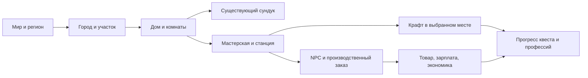

# Frontend: мир, город, мастерская и развитие

Выпуск в test 2026-09-27: `f69e9324a0b90d679ce552329b16815fbcdce517`, feature-коммит `2c60ffa`. [CI, сборка и деплой успешны](https://github.com/fedornabilkin/ablaki-front/actions/runs/36323331891). Бэкенд `f48595f11aea811687cbd92f976473dc1419a3ca`, schema marker 17; world_read/world_write открыты, активация storage/wallet и публикация календаря остаются отдельными шагами. Блоки до J7 опубликованы; игровая и визуальная приёмка не выполнялась. Ниже сохранены исторические отметки разработки.

Дата: 2026-09-26. Обновлено: 2026-09-27. Статус: предыдущий интерфейс опубликован в test (`99ddfb6`), сборка и штатные unit tests прошли. Новые блоки помещений, шалаша, ночей/здоровья, ремонта укрытия и огорода добавлены в `feature/09-worlds` без сборки, проверок и выкладки.

Пятнадцатый блок: [места оборудования в помещениях](../../../back/docs/world-equipment-expansion-implementation.md). Новые поля публикации/каталога и панель комнаты: состояние мест, цены/итог, взнос с личного Cr и постоянные права. Общий WorldExpansionCost переиспользуется огородом. Остальные объекты J3 ещё впереди; проверки, сборка и выкладка не выполнялись.

`[x]` означает готовый код блока, не пройденную приёмку. [Общее состояние и следующий шаг](../../../back/docs/world-implementation.md).

Шестнадцатый блок: [жильё и ночлег](../../../back/docs/world-housing-implementation.md). Дом в каталоге, отдельная койка в условиях покупки, панель комнаты с назначением/отменой и ссылкой на текущее укрытие. Контракты/pending retry связаны с ночами и шалашом. Проверки, сборка и выкладка не выполнялись.

Экономический блок: после бюджетов/казны, вложений, сборов, обязательств и правил добавлены оплаченные заказы поселения: список/поиск, публикация с резервом, выбор ячейки, сдача и отмена. Начальные правила ненастроенной стоянки показываются до подтверждения; опубликованные сохраняются. Кошелёк/мир ещё не активированы. Межобъектный batch, возраст/прогноз поступлений, сводки и покупки впереди. [Текущее состояние](../../../back/docs/world-orders-implementation.md).

Частично: A1 — world/storage/equipment/workspace/recovery DTO, без экономики и строительства; A5 — обновление навигации/хранилищ, без полной общей инвалидации; B1 — world routes и `/city/demo`, прежний `/city` ещё не переключён; B4 — отдельный WorldMap; B5 — панель и размещение без строительства. C1 — список мест без фильтра подходящих вещей до preview; C3 — отдельный storage список вместо CraftSlotGrid; C5 — `/craft?node`, источники/выход и выбор физических экземпляров готовы, покупка помещений впереди. C6–C8 — прочность, ремонт, красная нехватка, workspace и recovery владельца добавлены; занятость NPC ещё отсутствует. [Мастерская](../../../back/docs/world-workspace-implementation.md), [переход хранения](../../../back/docs/world-storage-rollout.md). Шалаш и ночлег H1–H3 впереди.

## Цель и контекст

Связать серверный мир с действующей мастерской: строить дом, ставить в нём существующий сундук, размещать станцию в мастерской, назначать NPC, видеть производство/экономику/квесты и развитие. Сохраняются Vue 3, TypeScript, Naive UI, Pug/SCSS, Font Awesome, текущая тема, Vuex auth и Pinia новых доменов.

Основание: [ТЗ](../../../back/docs/tz/world.md), [архитектура и сравнение с реализацией](../../../back/docs/world-architecture.md), [API](../../../back/docs/world-api.md). Зависимости: [BE](../../../back/docs/plan/2026-09-26-world-backend.md), [DB](../../../back/docs/plan/2026-09-26-world-database.md). Межрепозиторные ссылки рассчитаны на соседние `back` и `frontend`; задачи этого документа обозначаются `FE:A1` и т. п.

Дополнение владельца: [шалаш, ночлег, улица, счета и расширения](../../../back/docs/world-gameplay-economy.md). Группы H–J добавлены к S1/S2. UI различает личный баланс, бюджет и казну объекта. «Собрать» переводит в собственный бюджет, «Выплатить» — из бюджета в казну родителя; несобранная казна теряет Cr со временем. Это не локальная симуляция и не автоматический сбор.

## Текущее состояние и решения

| Сейчас | Как развиваем |
|---|---|
| `/city`, `store/city.js`, `services/city/mock.js`: локальный бюджет, сетка 8×8, таймер, localStorage по user | `/city` остаётся входом, при запуске мира ведёт в серверное поселение. Локальное демо сохраняется явно отдельно с прежними save keys; его данные не отправляются как имущество/Cr. |
| `CityGrid`, `BuildPanel`, `EventsLog` зависят от локального store | Выделяем компоненты отображения/событий, server adapter и отдельный demo adapter. Не запускаем локальный `tick/accrue/rollEvents` для серверного города. |
| `/craft`: карта рецептов, ремёсла, инвентарь, repair, starter/gather | Сохраняем маршрут, вкладки, все текущие действия; добавляем выбранную мастерскую и доступные источники. Географическая карта — другая страница. |
| `classicCraft.ts` требует сундук в backpack slots | Старый parser остаётся для legacy API. Новый workspace DTO проверяется отдельным parser, где есть storage и location. |
| `useClassicCraft.ts`: request key, pending в sessionStorage, защита смены аккаунта | Повторяем этот протокол для новых команд; по возможности выделяем общий runner после появления второго потребителя. |
| `CraftSlotGrid`/`CraftInventory`: компактные ячейки, имя снизу, иконка слева сверху, число справа | Переиспользуем без изменения размеров сетки. Слоты установки здания имеют собственный layout и не растягивают рюкзак. |

## Информационная архитектура

| URL | Экран |
|---|---|
| `/world` | Мир, регионы, глобальные события и обзор; серверное чтение. |
| `/world/nodes/:id` | Страница уровня: регион/город/здание/комната/участок; крошки и один текущий уровень карты. |
| `/city` | Вход в выбранный/свой город; явный выбор поселения при отсутствии сохранённого. |
| `/city/demo` | Существующая локальная симуляция с отдельным бюджетом, сохранениями и сбросом только демо. |
| `/craft?node=:id&item=:id` | Та же мастерская в контексте доступного здания/комнаты; существующий item link сохранён. |
| `/world/storage/:id` | Адресуемый сундук/склад с содержимым и хлебными крошками места. |
| `/world/economy?node=:id` | Сводка и журнал, фильтры периода/объекта/ресурса/события. |
| `/character/levels`, `/character/limits` | Профессии, условия, доступные действия и причины ограничений. |
| `/character/home` | Получение шалаша, выбранный ночлег, ближайшая ночь, болезнь и восстановление. |
| `/world/npcs`, `/world/npcs/:id` | Работники, дом, назначение, профессии/обучение/состояние. |
| `/quests`, `/quests/:id` | Квесты, цели, источники прогресса, награды и получение. |
| `/world/events/:id` | Событие и доступные действия противодействия. |

Ссылка на существующую Yii-админку доступна по permission, отдельная SPA-админка для MVP не строится. World/экономика/инвентарь требуют актуальной сессии по принятому API; публичные сводки можно открыть позднее отдельным permission. Любой переход — настоящий router-link/URL с history; поиск и фильтры используют `useListQuery`/`PagePager`. Просмотр узла не меняет физическое положение персонажа.

## Группа A: Контракты S0 и состояние S1

- [ ] A1. Создать TS DTO и runtime parsers в `services/api/world.ts`, `craftWorkspace.ts` и доменные типы в `entities/world`, `entities/city`, `entities/craft`. Зависит от BE:A2; unknown тип узла/ошибочная revision/некорректный ID не принимаются как валидное состояние.
- [x] A2. Добавить API adapter через существующий `httpClient.ts`, server pagination и typed errors. Зависит от A1; не импортировать store/UI из транспортного клиента, старый classicCraft parser не ослаблять.
- [x] A3. Реализовать command runner с точной pending-командой, прежним request key на retry, account/session epoch и expected revisions. Зависит от A2; timeout/5xx сохраняет запрос, 409 требует обновления и нового подтверждения изменившихся условий.
- [x] A4. Реализовать feature/capability loading и состояния обновления схемы/отключённой записи. Зависит от A2,BE:A1; недоступный сервер не переключается молча на демо и не показывает локальный успех.
- [ ] A5. Создать раздельное состояние навигации и экономических сущностей с invalidation по changed IDs/revisions. Зависит от A3; поздний GET не перезаписывает результат команды, смена пользователя очищает частные данные и pending другого владельца.

## Группа B: Мир и серверный город — S1

- [ ] B1. Добавить routes и переход `/city` к серверному поселению с сохранением пути к демо. Зависит от A4; существующее localStorage не удаляется и не импортируется как серверный баланс/город.
- [x] B2. Реализовать WorldNavigator: крошки, текущий node, parent, дети и соседние объекты. Зависит от A5,BE:B4; back/forward и прямой URL восстанавливают контекст, скрытые узлы не проявляются в крошках.
- [ ] B3. Выделить CityGrid/BuildPanel в компоненты с props/emits и подключить server adapter. Зависит от B1–B2; сетка и знакомые типы зданий сохраняются, Browser timer не начисляет средства и не разыгрывает события сервера.
- [ ] B4. Сделать карты по уровням и мобильный список с теми же действиями. Зависит от B2–B3; карта не загружает все комнаты мира, клавиатура и touch доступны, данные из одного DTO.
- [ ] B5. Реализовать панель объекта с типом, состоянием, владельцем, доступными действиями и серверными причинами блокировки. Зависит от BE:B3–B4,A2; read-only чужое здание не показывает редактор/склад по одному лишь наличию ID.
- [ ] B6. Реализовать покупку/строительство комнат/участков: место → preview Cr/материалов/срока/бюджета → команда → серверный прогресс. Зависит от B5,BE:D1–D5,I1–I2; бесплатное помещение не подставляется при пустом бюджете, изменившийся quote требует нового подтверждения.
- [ ] B7. Реализовать ремонт/паузу/снос с перечнем блокирующих вещей/NPC/заданий. Зависит от B6,BE:D6; «снести» не удаляет локально здание до подтверждённого ответа.

## Группа C: Станции и сундуки в постройках — S1

- [ ] C1. Реализовать список комнат и монтажных слотов с подходящими вещами/размерами/типами. Зависит от B5,BE:C3; несовместимые предметы имеют объяснение, скрытого автопереноса нет.
- [x] C2. Реализовать install/move/uninstall через preview и command runner, мышью и альтернативой «Выбрать → Разместить». Зависит от C1,A3; DnD не является единственным способом на телефоне/клавиатуре.
- [ ] C3. Переиспользовать CraftSlotGrid для рюкзака и сундука с явным storage ID и контекстом. Зависит от A1,BE:C6; размеры ячеек/название снизу/иконка и количество сверху сохранены, монтажный слот не считается купленным слотом рюкзака.
- [x] C4. Добавить страницу/панель размещённого сундука: путь к дому, содержимое, capacity, durability, ремонт и разрешения. Зависит от C3,BE:C5–C6; новый DTO допускает отсутствие сундука в рюкзаке без создания его копии.
- [ ] C5. Добавить контекст площадки/мастерской и выбор станции/источников в `/craft`. Зависит от C2–C4,BE:C4,BE:C7; материалы по умолчанию из рюкзака, но станцию в мировом режиме надо разместить. Наружный/защищённый источник и цена помещения показаны по H3–H4.
- [ ] C6. Показать индивидуальную прочность, сломанную/занятую станцию, износ ремонта и красную нехватку материалов. Зависит от C5; детали стопки позволяют выбрать единицу по instance_id, quote и commit используют тот же экземпляр. Стопки по 10 сохраняются, перемещение/merge не рисует «новую» прочность.
- [ ] C7. Обновлять обе стороны после команды: рюкзак, комнату, сундук, доступность рецептов и общий счёт при его изменении. Зависит от C2–C6,A5; уход со страницы/повтор/смена аккаунта не оставляют дубликаты предмета.
- [ ] C8. Добавить recovery/read-only overflow с безопасным извлечением. Зависит от BE:C8,C3; истечение lease, разрушение здания и переполнение не скрывают навсегда вещи пользователя.

## Группа D: NPC, производство и экономика — S2

- [ ] D1. Реализовать список/карточку NPC и рабочих мест: дом, профессия, состояние, зарплата, назначение/отзыв. Зависит от BE:E3–E4,A2; свободные жители и именованные NPC не складываются повторно.
- [ ] D2. Реализовать обучение NPC с preview программы/цены/времени и ожидаемого XP. Зависит от BE:E5,D1; прогресс берётся с сервера, локальный таймер только отображает срок.
- [ ] D3. Реализовать производственный заказ: recipe, работник, станция, input/output storage, нормы ресурсов, reserves. Зависит от BE:E6–E7,C5,D1; занятые вещи нельзя предложить как свободные, отказ имеет понятную причину.
- [ ] D4. Реализовать состояние выполнения/паузы/нехватки выхода и отмену заказа. Зависит от D3; повтор завершённой команды не добавляет локальную продукцию, отставание worker видно отдельно от ошибки сети.
- [ ] D5. Реализовать страницу экономики со scope, доходом/расходом/долгом/ресурсами, completed tick и фильтрами журнала. Зависит от BE:F7,A2; денежные strings отображаются без расчётов float на клиенте, частные суммы не кешируются в общем обзоре.
- [ ] D6. Переиспользовать панели I1–I6 для производства/NPC: пополнение бюджета, сбор собственной казны, выплата наверх. Зависит от BE:F2,D5,I1–I6; вывод казны на личный счёт не подменяет сбор в бюджет объекта, локальный «Собрать» демо изолирован.
- [ ] D7. Добавить графики/прогноз и разбивку факторов эффективности. Зависит от D5,BE:F7; прогноз помечен как расчёт по текущим условиям, неполный tick не выглядит завершённым доходом.

## Группа E: Развитие, события и квесты — S3

- [ ] E1. Реализовать `/character/levels` с пятью профессиями, XP, условиями, наградами и прогрессом. Зависит от BE:E3; текущие ремёсла 1–100 показаны отдельно, прежние уровни не пересчитаны по новой шкале.
- [ ] E2. Реализовать `/character/limits`: поиск, фильтр профессии/действия, typed reasons, ближайшие цели и ссылки к доступному действию. Зависит от E1,A2; правило не пересчитывается независимо от сервера.
- [ ] E3. Реализовать события на карте/объекте и страницу события с действием противодействия. Зависит от BE:G1–G3,B5; временный эффект и постоянное повреждение различаются, скрытые объекты scope не раскрываются.
- [ ] E4. Реализовать список/карточку квеста: принять, цели, rewards, ready/claimed/expired/abandoned. Зависит от BE:G4–G5; серверный прогресс может обновиться с задержкой, нажатие «забрать» не начисляет награду оптимистично.
- [ ] E5. Пройти первый квест дома/сундука/станции/NPC/заказа со ссылками на нужные экраны. Зависит от E4,C7,D4,BE:G6; direct URL и перезагрузка не теряют текущий шаг.
- [ ] E6. Добавить уведомления и настройки, ограниченный polling видимой страницы. Зависит от BE:G7,A5; timers/subscriptions очищаются при уходе, события не смешиваются между аккаунтами.

## Группа F: Контент, доступность и мобильная версия — S3

- [ ] F1. Подключить серверные имена/иконки/описания шаблонов и проверить полный seed §27. Зависит от BE:H4,B5; интерфейс не содержит второй hardcoded каталог цен/правил.
- [ ] F2. Добавить permission-aware ссылку на действующую админку и view-only previews изменённого контента в игре. Зависит от BE:H1–H2; скрытие ссылки не считается серверной защитой.
- [ ] F3. Проверить все действия на ширине 360/390/768/1280: карта/список, крошки, рюкзак и сундук, монтаж, длинные имена, красные причины. Зависит от B–E; нет увеличения ячеек рюкзака и перекрытия формы картой.
- [ ] F4. Проверить клавиатуру/фокус/контраст/доступные названия, возврат фокуса после диалога, без обязательного DnD. Зависит от F3; установка и перенос выполняются без мыши.

## Группа G: Проверки и выпуск

- [ ] G1. Добавить contract/parser и поведенческие тесты новых сценариев, выполнить `npm run test:unit` и `npm run build`. Зависит от соответствующего среза; проверяются права по DTO, stale response, retries и сохранность UX, а не механическое повторение implementation.
- [ ] G2. Проверить реальные API responses test через parsers после DB migration. Зависит от BE:I1,DB:H1,G1; обычный legacy craft и новый workspace проходят одновременно.
- [ ] G3. Провести совместную проверку двух вкладок/двух аккаунтов, обрыва после commit и обновления страницы. Зависит от G2; нет повторной покупки/установки/claim и данных прежнего владельца.
- [ ] G4. Выполнить визуальную проверку desktop/телефона с фиксацией результата. Зависит от F3–F4 либо соответствующего UI среза; сборка/renderer test не заменяют реальный осмотр.
- [ ] G5. Переключать `/city` на server mode только после BE/DB gates и подтверждения G1–G4 для среза. Старые save keys демо сохранены; откат клиента поддерживает новый storage contract.
- [ ] G6. Записать SHA/API schema/feature flags и результаты в этот план после выпуска. Зависит от G5; feature→test, затем та же feature→master после готовности релиза, test не сливается в master.

## Группа H: Старт, ночлег, здоровье и защита станций — S1

- [x] H1. Добавить карточку стартового права «Получить шалаш», preview/commit в рюкзак или прямо на площадку, runtime parsers и pending retry. Разовое право и отдельный craft starter сохранены; код без сборки/приёмки.
- [x] H2. Реализовать панель ближайшей/текущей и первой учитываемой ночи, льготного срока, болезни и восстановления; журнал по 20 ночей, фильтр исхода и prefix=nights в URL. Условный прогноз не заменяет сохранённый результат; состояние сервера и отставание worker видны. Код без сборки/визуальной приёмки.
- [x] H7. Добавить установку/складывание, назначение/отмену ночлега, явное подтверждение прекращения при fold, текущую прочность и срок защиты. Показано, что болезнь пока не включена; без визуальной проверки и сборки.
- [x] H8. Добавить расчёт и подтверждение ремонта шалаша, материалы из рюкзака с красной нехваткой, прочность до/после, сохранение ночлега и объяснение исторической защиты. Разрешён ремонт сломанного и установленного шалаша без складывания; runtime parser и pending retry поддерживают новый action. Код без сборки/приёмки.
- [ ] H3. Показать наружные места станций и классы outdoor/covered/indoor: износ за работу/время, время расчёта, защита от погоды. Зависит от C1–C2,BE:K4–K5; шалаш не отображается как бесплатная крытая мастерская.
- [ ] H4. Добавить покупку комнаты/навеса за Cr с явным бюджетом и переносом существующей станции. Зависит от H3,B6,I2,BE:K6; до world activation текущий craft доступен, после сложенная станция имеет действие «Разместить» вместо обхода износа.
- [ ] H5. Проверить новые экраны на телефоне/клавиатуре: grant, сон, болезнь, уличная станция, платная защита. Зависит от H1–H4; время приходит с сервера, отсутствие открытой вкладки не рисуется как защита/лечение.

- [x] H6. Добавить каталог готовых навесов/мастерских с поиском/пагинацией, публикацией/снятием и покупкой из бюджета площадки; показать цену, казну получателя, площадь, защиту и постоянство покупки до подтверждения. Подключены runtime parsers и точный повтор команды. Код без сборки и приёмки; H4 остаётся открытым для полного сценария с переносом/активацией.

## Группа I: Бюджет, казна, сбор и потери — S1

- [ ] I1. Добавить общую финансовую панель объекта: бюджет свободный/зарезервированный, казна, потери, обязательства и финансовый родитель. Зависит от A2,BE:L1,BE:L8; три суммы «личные Cr / бюджет / казна» не сливаются в один баланс.
- [ ] I2. Реализовать «Внести Cr в бюджет» и целевое финансирование дочернего объекта, включая явное «внести недостающее и купить». Зависит от I1,BE:L2; quote показывает источник, получателя, сумму и две части составной покупки, отмена ничего не списывает.
- [ ] I3. Реализовать ручной «Собрать в бюджет этого объекта» и batch доступных собственных объектов. Зависит от I1,BE:L3,BE:L6; не отправлять collect при GET/монтировании/таймере, новый доход не включается в повтор прежней команды.
- [ ] I4. Реализовать список начисленных отчислений и «Выплатить в казну города/региона/мира» с суммой/ставкой/сроком. Зависит от I1,BE:L4; получатель задан invoice, пользователь не редактирует ID ради обхода права, просрочка и резерв видны.
- [ ] I5. Показать возраст несобранных поступлений, защитный срок, следующий расчёт разграбления, ставку/прогноз и уже потерянные Cr. Зависит от I1,BE:L5–L6; задержка worker отображается как catch-up, обновление страницы не сбрасывает обратный отсчёт.
- [ ] I6. Добавить журнал и схему казна→свой бюджет→казна родителя с отдельными типами дохода/потерь/вложений/выплат. Зависит от I2–I5,BE:L8; доход мира не умножается на число уровней, внутренний перевод не обозначается продажей.

- [x] I7. Добавить расчёт/подтверждение сбора одного объекта, резерв на отчисления и состояние ожидания фоновых потерь; команды используют прежний ключ при сетевом повторе. Код без сборки и проверок.
- [x] I8. Добавить приватный список обязательств с серверной пагинацией, фиксированным получателем, сроком/просрочкой и отдельным preview/commit оплаты. Полный финансовый отчёт I1/I6 ещё открыт.
- [x] I9. Добавить административную публикацию правил: обязательные проценты/сроки и причина, условия перед подтверждением, пустые исходные настройки. Авторизация остаётся на сервере; проверки отложены.

- [x] I10. Добавить страницу заказов внутри поселения с серверным поиском/статусом/пагинацией, выбором конкретной стопки рюкзака и расчётом сдачи в казну стоянки. Запросы из прежней сессии отсекаются, повтор сохраняет ключ. Код без сборки/проверок.
- [x] I11. Добавить публикацию конечного заказа из бюджета с ценой/лимитом/сроком и начальной политикой стоянки, расчёт резерва и отмену остатка. Серверные права ограничены владельцем или администрацией системного поселения.

## Группа J: Грядки и аналогичные расширения — S1–S2

- [x] J1. Добавить предложение поселения, покупку со стоянки и панель огорода с десятью постоянными грядками и ссылками на их финансы. Номера/цены/доступность приходят с сервера; посев явно ещё закрыт. Runtime parsers и pending retry; без сборки/приёмки.
- [x] J2. Добавить расчёт следующих 1–9 грядок, отдельные цены и итог, источник бюджета и казну получателя. Явная галочка пополнения показывает обе финансовые части и остаток личного Cr; изменившийся quote требует нового подтверждения. Код без проверок/выкладки.
- [ ] J3. Переиспользовать панель расширения для комнат/коек, мест станков/работников, прилавков, мест клуба, секций склада. Зависит от J2,BE:M1,BE:M6; initial/limit/price берутся из шаблона, покупка места не обещает бесплатного NPC/станок.
- [x] J6. Добавить условия расширения в публикацию/каталог помещений и панель покупки мест на странице комнаты. WorldExpansionCost разделяет отображение финансовых частей с огородом; runtime parser и pending retry подключены. Код без сборки/приёмки; жильё, NPC и остальные объекты J3 впереди.
- [ ] J4. Реализовать культуру, посев/полив/срок урожая/причину паузы/сбор и продажу — S2. Зависит от J1,BE:M4–M5; урожай зачисляется предметами в выбранный склад, только продажа пополняет казну грядки; повтор не удваивает результат.
- [x] J7. Добавить дом с койкой в публикацию/покупку помещений, ограничения площади, WorldHousingPanel и ссылки дом↔шалаш для единственного назначения ночлега. Runtime parsers и восстановление pending-команды подключены. Код без сборки/приёмки; расширение коек/комнат и NPC остаются в J3.
- [ ] J5. Пройти тесты двух вкладок/сбоя ответа и визуальную проверку всего стартового пути с нулевым балансом. Зависит от H1–H5,I1–I6,J1–J3,BE:L7; новый игрок может заработать/собрать/оплатить первое помещение, ошибка не гасит grant/покупку и не скрывает потери.

## Критерии готовности и границы

S1: игрок вручную получает шалаш, назначает ночлег, ставит станцию на улице, видит износ/болезнь/потери казны, собирает доход в бюджет и покупает защищённую комнату/грядки; текущие вещи и стопки сохраняются. S2: NPC/заказ/урожай и выплаты по иерархии работают независимо от вкладки. S3: полный контент, профессии, события, квесты и проверенный мобильный UI. Новые H–J не считаются выполненными только от написания плана.

Не включаем в этот план реализацию боёв, P2P рынка, физического перемещения персонажа или SPA-редактора всего контента. Их будущие интерфейсы используют подготовленные actor/storage/requirements/command contracts. Старые незакрытые визуальные проверки крафта не считаются автоматически выполненными от появления этого плана.
